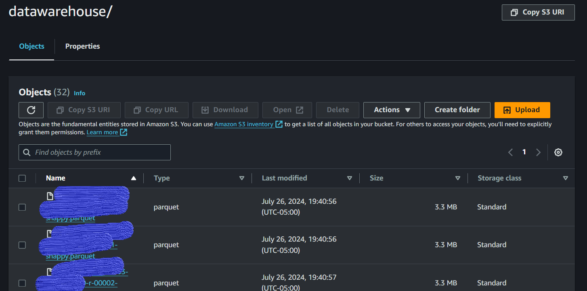

## Data Warehouse Output

After the ETL process is completed using AWS Glue, the transformed data is stored in the `datawarehouse` folder of an Amazon S3 bucket. This folder contains data files in Parquet format, optimized for efficient querying and analysis. Below is a screenshot of the `datawarehouse` directory, showing the structured data ready for analysis.

*Figure: Screenshot of the `datawarehouse` folder in Amazon S3, containing Parquet files produced by the ETL process.*

### Key Points:
- **Storage Format:** The data is stored in Parquet format, which is highly efficient for both storage and query performance.
- **Compression:** Files are compressed using the Snappy compression algorithm, reducing storage costs and improving data retrieval times.
- **Data Organization:** The files are organized in a way that supports partitioning and efficient access patterns, facilitating quicker data retrieval during analysis.

This data warehouse structure ensures that the data is clean, well-organized, and ready for further analysis and visualization, such as through Amazon QuickSight or other analytics tools.
