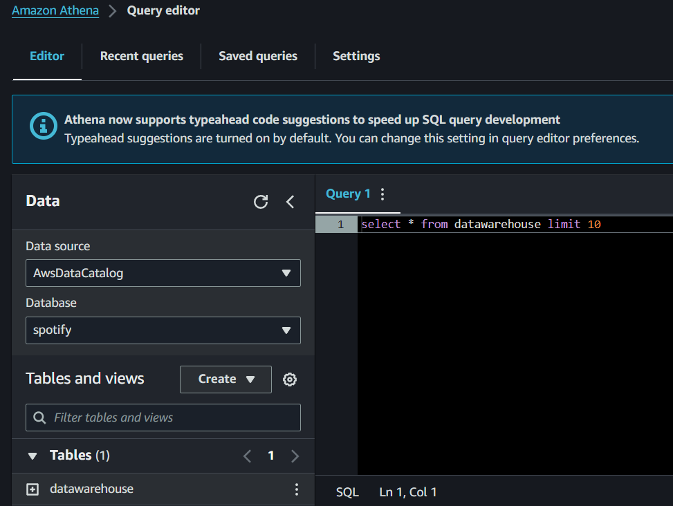

## Amazon Athena Querying

Amazon Athena is a serverless, interactive query service that allows for easy analysis of data in Amazon S3 using standard SQL. In this project, Athena is used to query the processed data stored in the `datawarehouse` folder after the ETL process.

*Figure: Screenshot of the Amazon Athena Query Editor showing a sample SQL query on the `datawarehouse` table.*

### Key Features:
- **Data Source Integration:** Athena integrates with the AWS Glue Data Catalog, allowing it to query the data cataloged by the AWS Glue Crawler.
- **SQL Querying:** Users can write SQL queries to analyze data directly in the S3 `datawarehouse` bucket. The example query shown selects the first 10 rows from the `datawarehouse` table.
- **Cost Efficiency:** Athena charges only for the queries you run, billed per terabyte scanned, making it a cost-effective solution for large-scale data analysis.
- **Ease of Use:** With no infrastructure to manage, Athena makes it easy to set up and start querying data almost immediately.

### Use Case:
In this project, Amazon Athena is used to quickly query and analyze the data transformed and stored in Parquet format by the ETL pipeline. This allows for efficient exploration and insights generation from the data.

Athena's serverless nature and integration with other AWS services make it an ideal tool for data scientists and analysts looking to derive insights from large datasets without managing complex infrastructure.
