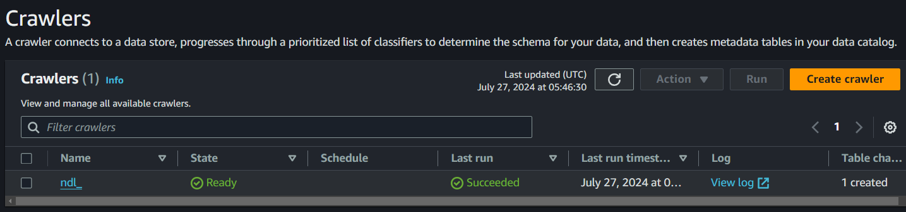

## AWS Glue Crawler

The AWS Glue Crawler is a crucial part of our data pipeline, tasked with automatically discovering and cataloging the data stored in Amazon S3. By scanning the data, the crawler determines the schema and creates metadata tables in the AWS Glue Data Catalog, facilitating easy querying and analysis.

*Figure: Screenshot of the AWS Glue Crawler interface, showing the successful execution of the crawler named "ndl_"*

### Key Functions of the AWS Glue Crawler:
- **Data Schema Detection:** Automatically detects the structure of the data and updates the schema information in the Glue Data Catalog.
- **Scheduled Runs:** The crawler can be scheduled to run at specified intervals, ensuring that the Data Catalog is always up-to-date with the latest data changes.
- **Integration with AWS Services:** The metadata created by the crawler is utilized by Amazon Athena for querying and Amazon QuickSight for visualization, making the data easily accessible for analysis.

### Benefits:
- **Automation and Efficiency:** Reduces manual work in data cataloging and schema management, allowing data engineers to focus on more critical tasks.
- **Consistent Data Availability:** Ensures that all new and modified data is immediately available for querying, supporting real-time data analytics and business intelligence.
- **Scalability:** Capable of handling large datasets and complex data structures, making it suitable for enterprise-level data operations.

The Glue Crawler's role in our ETL process ensures that data is properly indexed and accessible, providing a robust foundation for downstream analytics and reporting activities.
