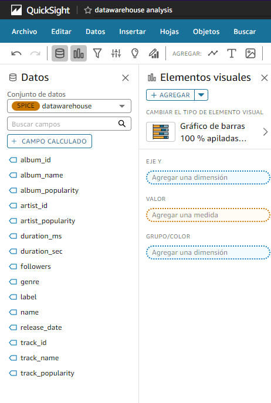

## Amazon QuickSight Data Visualization

Amazon QuickSight is a scalable, serverless, embeddable, and machine learning-powered business intelligence (BI) service built for the cloud. In this project, QuickSight is used to visualize and analyze data from the `datawarehouse` that has been processed and cataloged.

*Figure: Screenshot of the Amazon QuickSight interface displaying fields available for data visualization from the `datawarehouse` dataset.*

### Key Features:
- **Interactive Dashboards:** QuickSight provides tools to create interactive dashboards that can be shared with team members, allowing for real-time data exploration and insights.
- **Data Integration:** Integrates seamlessly with Amazon Athena, enabling the use of SQL queries to fetch and analyze data from the S3 `datawarehouse`.
- **Visual Elements:** Users can choose from various visualization types, such as bar charts, pie charts, and heat maps, to present data in a meaningful way.
- **SPICE:** The Super-fast, Parallel, In-memory Calculation Engine (SPICE) accelerates query performance, allowing for the quick analysis of large datasets.

### Use Case:
In this project, Amazon QuickSight is utilized to create visualizations that help understand the trends and patterns in Spotify data. The data fields available for analysis include attributes like `album_name`, `artist_popularity`, `genre`, and `track_popularity`, among others.

By leveraging QuickSight's robust visualization capabilities, stakeholders can derive actionable insights and make data-driven decisions. The use of SPICE further enhances the ability to handle and analyze large volumes of data efficiently.

This tool's integration into the data pipeline allows for a comprehensive end-to-end data processing and analysis workflow, from data ingestion and transformation to visualization and decision-making.
